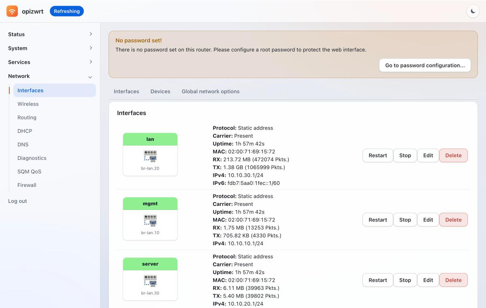
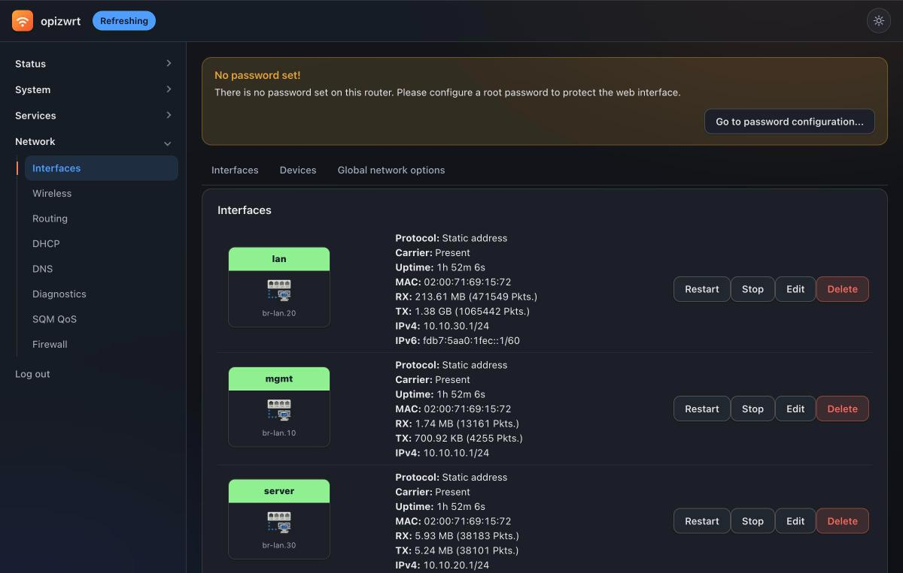
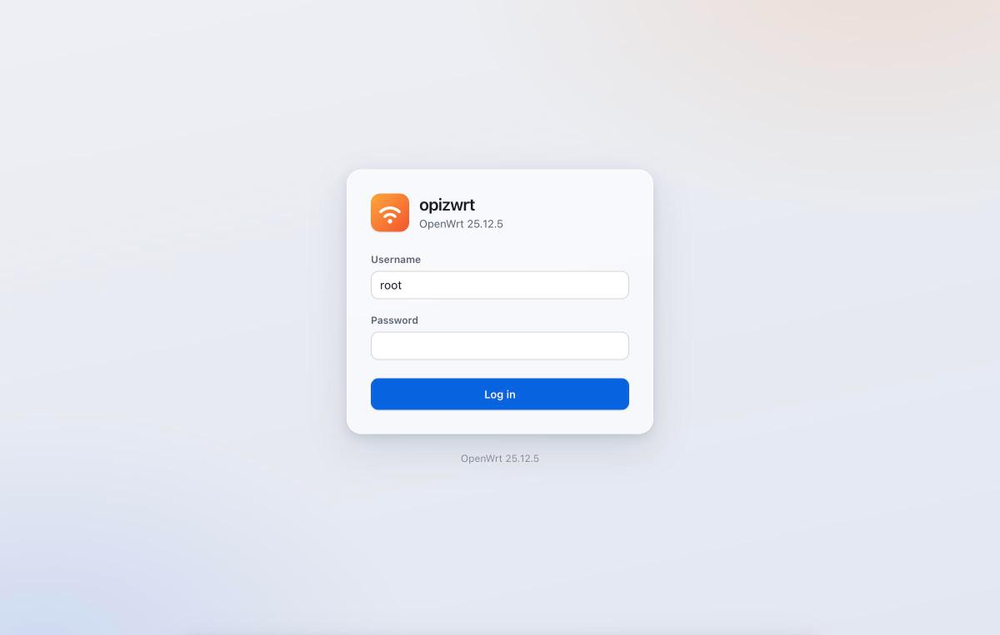
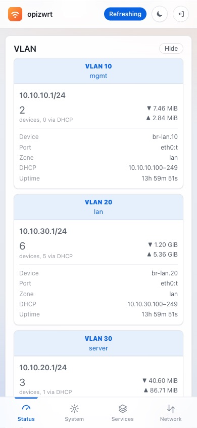

# luci-theme-opizwrt

A liquid-glass theme for OpenWrt's LuCI web interface, with a real dark mode
and a login page of its own.



<table>
<tr>
<td width="50%"></td>
<td width="50%"></td>
</tr>
</table>

<p align="center">
  
</p>

## Requirements

LuCI with **ucode** templates — OpenWrt **24.10+**. Releases are `.apk`, so they
need OpenWrt 25.12+; on older releases build from source. The theme carries no
architecture-specific code, so one package works on every target of the same
release.

> **Only tested on one setup.** This theme was built for, and has only been
> installed on, OpenWrt 25.12.5 running on an Orange Pi Zero 3
> (`sunxi/cortexa53`). It should work anywhere LuCI does, but no other release
> or target has been verified. Reports welcome.

## Install

```sh
wget -O /tmp/luci-theme-opizwrt.apk \
  https://github.com/rizkirmdhnnn/luci-theme-opizwrt/releases/latest/download/luci-theme-opizwrt.apk
apk add --allow-untrusted /tmp/luci-theme-opizwrt.apk
```

The package makes itself the active theme. Reload the page.

`-O` is not optional — OpenWrt's `wget` names the file after the *redirected*
URL, leaving you a UUID instead of an `.apk`.

<details>
<summary>From source</summary>

```sh
cd openwrt
git clone https://github.com/rizkirmdhnnn/luci-theme-opizwrt.git \
          package/luci-theme-opizwrt
make menuconfig     # LuCI -> Themes -> luci-theme-opizwrt
make package/luci-theme-opizwrt/compile V=s
```
</details>

## Switching back

**Switch away before uninstalling.** Removing the active theme leaves LuCI with
no templates, and the web interface stops loading until you fix it over SSH.

```sh
uci set luci.main.mediaurlbase=/luci-static/bootstrap && uci commit luci
apk del luci-theme-opizwrt
```

Or from LuCI: **System → System → Language and Style**.

## Contributing

```
theme-src/cascade.css            the stylesheet you edit
tools/build-css.sh               minifies it into htdocs/
htdocs/luci-static/opizwrt/      cascade.css (GENERATED), logo.svg
htdocs/luci-static/resources/    menu-opizwrt.js
ucode/template/themes/opizwrt/   header.ut, footer.ut, sysauth.ut
```

**Edit `theme-src/cascade.css`, never the copy under `htdocs/`.** Run
`./tools/build-css.sh` and commit both. CI fails if they drift apart.

The split exists because the only minifier `luci.mk` knows about is csstidy,
which does not understand modern CSS — on this file it stopped a third of the
way through and still exited 0. esbuild does the job correctly outside the
buildroot, and the result is committed.

Source comments are in Indonesian.

## Credits

[luci-theme-bootstrap](https://github.com/openwrt/luci) (Steven Barth,
Jo-Philipp Wich, David Menting) →
[luci-theme-material](https://github.com/LuttyYang/luci-theme-material) (Lutty
Yang) → this theme.

## License

[Apache License 2.0](LICENSE), matching its upstream lineage.
